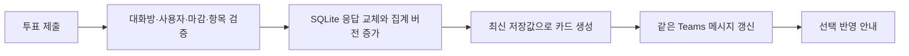

# 투표곰 설계

문서 작성일: 2026-10-07 · 버전: 0.1 · 대상: 구현 담당자와 운영자
설계 커밋 일자: 사용자 요청에 따라 2026-10-05, 한국 시간 적용
상태: 구현 전 검토용 설계. 이 문서의 커밋은 구현·배포 완료를 뜻하지 않음.

## 1. 요약과 범위

투표곰은 Teams 단체 대화방에서 구성원의 선택을 모으는 한국어 투표 봇이다.
`@투표곰`으로 명령 제안을 확인하고, 생성 폼을 작성한 뒤 같은 대화방에서 투표한다.
응답을 저장할 때마다 기존 투표 카드를 갱신하여 참여 인원과 항목별 표 수를 보여준다.
`../team-meal-bot`의 서버·저장소·카드·배포 구조를 재사용하되 식사 일정과 동작 시나리오는 가져오지 않는다. [1]

사용자 요구는 콜네임, 명령 제안, 생성 폼, 실시간 집계, 귀여운 한국어 문구, 기존 배포 구조 활용이다. [2]
초기 범위는 참조 프로젝트와 같은 `groupChat`으로 가정한다.
공개 기명 투표, 마감 전 응답 변경, 작성자 수동 마감을 설계 기본값으로 제안한다.
익명 투표, 예약 시작, 알림 독촉, 웹 관리 화면, 결과 내보내기는 초기 범위에서 제외한다.

첨부 이미지 2와 3은 같은 생성 폼이다. 결과 화면의 상세 배치는 이미지에서 확인할 수 없으므로 아래 집계 카드 설계를 제안한다.
현재 저장소에는 이미지 한 장만 있으며, 코드와 Git 저장소는 없다.

## 2. 접근 방식과 구조 재사용

| 방식 | 장점 | 부담 | 선택 |
| --- | --- | --- | --- |
| 기존 Teams 봇 구조와 Adaptive Card 재사용 | 운영 방식 일치, 기존 카드 갱신 경험 활용 | 투표용 도메인·테이블 구현 필요 | 권장 |
| 별도 웹 투표 화면 추가 | 화면 표현의 자유 | 로그인·웹 호스팅·Teams 연결 관리 추가 | 제외 |
| 외부 설문 서비스 연결 | 설문 기능 일부 위임 | 인증·외부 서비스 의존, 원하는 카드 흐름과 차이 | 제외 |

권장안은 하나의 Node 프로세스와 SQLite 파일로 운영한다.
**Adaptive Card**는 Teams가 입력란과 버튼을 그려 주는 카드 형식이다.
별도 프런트엔드 대신 카드 내용을 데이터로 생성한다.

| 참조 파일 | 투표곰에서 활용할 구조 | 변경점 |
| --- | --- | --- |
| `src/index.ts` | Express, JWT 검증, CloudAdapter, ActivityHandler, `/api/messages`, `/healthz` | 투표 생성·응답·마감 동작 연결 |
| `src/domain.ts` | 순수 명령 파싱과 검증 | 제목·항목·마감·선택 수 검증 |
| `src/service.ts` | 사용자 동작 처리와 권한 확인 | `PollService`, 작성자와 대화방 확인 |
| `src/cards.ts` | 카드 생성 함수 | 도움말·생성 폼·투표 및 집계 카드 |
| `src/store.ts` | Node 24 `node:sqlite`, 준비된 SQL | 별도의 투표곰 데이터베이스와 투표 테이블 |
| `src/scheduler.ts` | 주기적 처리와 저장한 대화 참조를 통한 카드 갱신 | 마감 처리와 실패한 카드 갱신 재시도만 유지 |
| `Dockerfile`, `compose.yaml`, `deploy/*.service` | 다단계 빌드, 영속 볼륨, 자동 재시작 | 서비스명·외부 포트·DB 경로 분리 |
| `scripts/package-teams-app.sh`, `appPackage/*` | manifest 치환과 아이콘 포함 ZIP 생성 | 투표곰 이름·소개·명령·아이콘 적용 |

참조 프로젝트의 `.env`, 실제 앱 ID, 비밀값, 데이터베이스와 응답 자료는 복사하지 않는다.
식사별 고정 선택지, 점심·저녁 일정, 공휴일 목록과 일정 변경 이력도 제외한다.
TypeScript·Express·Agents Hosting과 기존 테스트 도구를 활용하며 새 DB 라이브러리와 날짜 해석용 AI는 추가하지 않는다.

## 3. 호출과 생성 흐름

### 3.1 명령 제안

Teams 앱 manifest의 `bots[].commandLists`에 단체 대화방 명령 두 개를 선언한다.
명령 메뉴는 Teams 클라이언트가 표시하며, 서버는 선택 후 전송된 텍스트를 처리한다. [3]
입력 중 제안과, 실제로 `@투표곰`만 전송했을 때 보여주는 도움말 카드를 모두 제공한다.
클라이언트 테마·버전에 따른 메뉴 모양은 Teams가 결정하므로 이미지와 픽셀 단위 일치를 목표로 하지 않는다.
manifest는 참조의 1.22를 출발점으로 하고 해당 스키마와 대상 테넌트에서 명령 메뉴 동작을 검증한다.
새 슬래시 명령이나 비공개 targeted messaging은 이 흐름에 추가하지 않는다.

| 제안 제목 | 귀여운 안내 문구 | 전송 후 동작 |
| --- | --- | --- |
| `투표만들기` | `곰곰이 고를 투표를 만들어요! 제목을 적으면 미리 담아둘게요 🐻` | 생성 폼, 뒤에 쓴 텍스트는 제목으로 미리 입력 |
| `투표만들기 + 준비곰 목록` | `제목과 후보를 한 번에 쏙! 마감과 복수 선택도 챙겨요 🐾` | 제목·항목·설정을 미리 채운 생성 폼 |

두 번째 제안의 고정 접두사는 `투표만들기 +`이다. 제안 제목만 그대로 전송하면 빈 폼과 입력 예시를 보여준다.
명령 문법은 모호한 자연어 추측 대신 명시적인 구분자를 사용한다.

```text
@투표곰 투표만들기 오늘 뭐 먹을까요?
@투표곰 투표만들기 + "오늘 뭐 먹을까요?" "땡땡식당 (https://naver.me/xxxx)" "무슨식당" "초밥집" 마감: "금요일 18시" 복수
```

`+` 뒤 첫 큰따옴표 값은 제목, 이후 값은 후보 항목이다.
`마감:` 뒤 큰따옴표 값은 마감이며, 마지막 `복수`는 복수 선택 활성화이다.
큰따옴표 안의 큰따옴표·역슬래시는 각각 `\"`, `\\`로 입력한다.
생략한 마감은 없음, 생략한 복수 선택은 비활성화이다.
파싱 실패 시 투표를 시작하지 않고 빈 폼과 올바른 예시를 안내한다.
미리 채운 명령도 최종 폼의 ‘투표 시작’ 버튼을 눌러야 실제 투표가 만들어진다.

### 3.2 생성 폼

이미지 2의 세로 순서와 입력 종류를 유지한다. [2]
폼을 요청한 사용자 ID와 대화방 ID를 서버에 저장하고, 제출할 때 인증된 활동 정보와 대조한다.
카드에 ‘작성자만 제출 가능’이라고 쓰는 것만으로 권한을 대신하지 않는다.

| 영역 | 문구 | 동작 |
| --- | --- | --- |
| 제목 | `🐻 투표곰과 선택을 모아봐요!` | 폼 제목 |
| 설명 | `아직 준비 중이에요. 이 카드를 부른 분만 시작할 수 있어요 🐾` | 작성자 전용 제출 안내 |
| 제목 입력 | `어떤 걸 함께 골라볼까요? *` | `Input.Text`, 제목 |
| 항목 입력 | `후보를 한 줄에 하나씩 적어줘요! 2~10개예요 🧺 *` | 여러 줄 `Input.Text` |
| 항목 예시 | `땡땡식당 (https://naver.me/xxxx)` / `무슨식당` / `초밥집` | 한 줄마다 항목 하나 |
| 마감 입력 | `언제까지 고를까요? 비우면 계속 열어둘게요 ⏰` | 선택 입력 |
| 마감 예시 | `금요일 18시 / 8월 22일 18시 / 3시간` | 지원 문법 안내 |
| 복수 선택 | `여러 후보에 마음을 줘도 좋아요 🐾` | `Input.Toggle`, 기본 꺼짐 |
| 시작 버튼 | `🐻 투표 시작!` | `Action.Execute`, `pollCreate` |

서버 검증 규칙은 다음과 같다. 길이는 앞뒤 공백 제거 후 Unicode 코드 포인트 수로 센다.

- 제목 1~100자, 항목 이름 1~100자, 항목 2~10개 적용. 빈 줄 제거, 같은 이름의 후보는 오류 처리.
- 항목 끝의 `(https://...)` 또는 `(http://...)`를 선택 링크로 분리. 링크 최대 2,048자, 다른 스킴과 잘못된 URL 거부.
- 입력 전체 최대 8,000자 적용. 카드의 텍스트와 링크는 각각 이스케이프하여 표시.
- 링크는 서버에서 접속하거나 미리 가져오지 않음. 표시된 후보 이름과 ‘가게 구경하기’ 링크 동작을 분리.
- 마감 문자열 최대 100자. 알 수 없는 값과 이미 지난 명시적 시각은 오류 처리.
- 입력 오류 시 항목 이름과 수정 방법을 귀여운 한국어로 안내. 초안은 유지하며 수정 후 다시 제출 가능.
- 초안은 24시간 유효. 만료된 폼은 `앗, 준비 카드가 잠들었어요. 투표곰을 다시 불러줘요 🐻`로 안내.

### 3.3 마감 해석

서버의 기준 시간대는 `Asia/Seoul`, 저장 시각은 UTC이다.
마감은 생성 폼을 제출한 시각을 기준으로 다시 해석하며, 시작 전에 해석된 한국 시각을 카드에 표시한다.

| 입력 형식 | 해석 규칙 |
| --- | --- |
| 빈 값 | 자동 마감 없음. 작성자의 수동 마감 가능 |
| `N분`, `N시간`, `N일` | 양의 정수, 제출 시각부터 해당 기간. 최대 365일 |
| `금요일 18시`, `금요일 18:30` | 가장 가까운 미래의 해당 요일·시각. 같은 요일이라도 지난 시각이면 다음 주 |
| `8월 22일 18시`, `8월 22일 18:30` | 올해 해당 시각, 이미 지났으면 다음 해. 존재하지 않는 날짜 거부 |
| `2026-10-09 18:00` | 명시한 한국 시각. 지난 값 거부 |

요일 문법은 월요일부터 일요일까지 동일하게 지원한다. 0~23시, 0~59분 범위를 검증한다.
모든 마감은 제출 후 365일 이내로 제한한다. 범위 밖 날짜를 조용히 보정하지 않는다.
참조 프로젝트의 고정 식사 마감 함수를 복사하지 않고, 이 문법만 지원하는 순수 함수를 둔다.

## 4. 투표와 실시간 결과

### 4.1 투표 카드

생성 후 같은 대화방에 투표 카드를 게시한다.
제목, 작성자, 한국 시간 마감 또는 ‘마감 없이 열려 있어요’, 단일·복수 선택 안내를 표시한다.
`Input.ChoiceSet`으로 후보를 고르고 `🐾 내 선택 보내기` 버튼으로 제출한다.
단일 선택은 정확히 하나, 복수 선택은 하나 이상 최대 전체 후보 수까지 허용한다.
카드 선택값은 안정적인 항목 ID를 사용한다.

한 사용자에게 투표 하나당 응답 하나를 저장한다.
같은 사용자가 다시 제출하면 기존 선택 전체를 교체하고, 같은 요청의 재전송은 표 수를 늘리지 않는다.
선택 변경 전용 카드나 사용자별 자동 새로고침은 초기 구현에 추가하지 않는다.
공유 카드는 다른 사용자의 선택을 입력란 기본값으로 넣지 않으며 각자 원하는 선택을 다시 제출할 수 있다.

공유 카드 안의 집계 예시는 다음과 같다.

```text
🐻 오늘 뭐 먹을까요?
⏰ 금요일 오후 6시까지 · 여러 후보를 골라도 좋아요!
🐾 지금 5명이 마음을 모았어요 · 총 7표

땡땡식당 — 3표 · 참여자 기준 60%
민수 · 지연 · 수현
무슨식당 — 2표 · 참여자 기준 40%
지연 · 유진
초밥집 — 2표 · 참여자 기준 40%
수현 · 도윤

[후보 선택]
[🐾 내 선택 보내기] [🔄 최신 결과 보기] [🧸 이제 마감하기]
```

참여 인원은 응답 사용자 수, 총 표 수는 모든 사용자의 선택 수 합계이다.
항목 비율은 ‘해당 항목 선택 인원 / 전체 참여 인원’으로 계산하고 정수 반올림한다.
복수 선택이면 비율 합계가 100%를 넘을 수 있음을 안내한다. 참여자가 없으면 모든 비율은 0%이다.
후보는 입력 순서를 유지한다. 최다 득표와 동률 후보는 마감 카드에서 모두 표시한다.
참여자 이름은 항목별 최대 10명까지 표시하고 나머지는 ‘외 N명’으로 줄인다.
공개 기명 투표이며 구성원 이름이 대화방에 노출됨을 투표 카드에 명시한다.

### 4.2 갱신과 동시 응답

실시간 집계는 DB 저장 직후 기존 메시지를 `updateActivity`로 수정하는 의미이다. [1][4]
별도 WebSocket이나 반복 결과 메시지는 만들지 않는다.
Teams 클라이언트 표시 지연은 생길 수 있으며 모든 화면의 동시 표시 시간을 보장하지 않는다.



* 자료: 참조 프로젝트 흐름과 본 설계의 자체 구성.

SQLite 트랜잭션에서 응답 교체와 버전 증가를 함께 처리한다.
투표별 카드 갱신은 한 프로세스에서 순차 처리하고, 각 갱신 직전에 최신 DB를 읽는다.
완료된 카드 버전만 기록하여 늦게 도착한 과거 집계가 최신 카드를 덮지 않도록 한다.
주기 작업과 사용자 제출·새로고침도 같은 갱신 경로로 연결한다.
구현 시 `ponytail: 단일 프로세스의 투표별 갱신 순서 보장, 다중 인스턴스가 필요하면 분산 작업 처리로 교체` 주석을 남긴다.

카드 갱신 실패 시 저장한 투표는 유지한다.
`선택은 잘 담았어요! 결과판은 잠깐 쉬는 중이라 곧 다시 펼쳐둘게요 🐻`라고 안내한다.
`revision > published_revision`인 투표는 30초 주기 작업에서 최신 카드 갱신을 재시도한다.
‘최신 결과 보기’도 저장된 집계를 다시 표시한다.
재시작 후에도 미반영 버전과 마감 시각을 DB에서 읽어 복구한다.

### 4.3 마감과 권한

마감 시각 이상인 모든 응답은 서버에서 거부한다. 주기 작업 실행 전에도 적용한다.
작성자만 수동 마감할 수 있으며 서버에 저장한 작성자 ID와 인증된 사용자 ID를 대조한다.
공유 카드에는 마감 버튼이 보이지만 다른 사용자의 요청은 `마감은 이 투표를 만든 곰 친구만 할 수 있어요 🧸`로 안내한다.
다른 대화방에서 가져온 투표·초안 ID, 변조된 항목 ID, 빈 선택, 중복 선택 ID, 단일 투표의 여러 선택은 거부한다.

마감 후 카드에는 선택 입력과 제출·마감 버튼을 제거하고 최종 결과와 ‘최신 결과 보기’만 유지한다.
이전 열린 카드로 보낸 요청도 거부한다.
투표 시작 뒤 제목·후보·마감·복수 선택 설정 변경은 제공하지 않는다.
사용자는 새 투표를 만들어 정정한다.

## 5. 데이터와 오류 처리

### 5.1 최소 저장 모델

**SQLite**는 별도 DB 서버 없이 파일 하나에 자료를 저장하는 데이터베이스이다.
기존 식사 DB와 분리하며, SQL 매개변수와 외래 키 검증을 적용한다.

| 테이블 | 주요 필드 | 제약과 역할 |
| --- | --- | --- |
| `conversation` | Teams 대화방 ID, 대화 참조 JSON | 대화방 ID 고유. 재시작 후 메시지 갱신에 활용 |
| `draft` | ID, 대화방 ID, 작성자 ID, 폼 메시지 ID, 생성 시각 | 폼 작성자 확인, 24시간 만료, 재제출 식별 |
| `poll` | ID, draft ID, 대화방 ID, 작성자 ID·이름, 제목, 복수 선택 여부, 마감 UTC, 메시지 ID, 상태, revision, published_revision | draft ID 고유. 상태는 publishing/open/closed |
| `poll_option` | ID, poll ID, 순서, 이름, 선택 URL | 투표별 순서 고유, 외래 키 연결 |
| `vote` | poll ID, 사용자 ID, 이름, 선택 항목 ID 배열 JSON, 수정 시각 | 복합 기본 키로 사용자별 응답 하나 보장 |

선택 배열은 최대 10개이므로 JSON으로 저장한다. 작은 투표의 집계는 기존 카드 패턴처럼 저장된 응답을 읽어 계산한다.
테이블을 동적으로 추가하거나 별도 집계 캐시를 두지 않는다.
직접 DB 편집은 지원하지 않으며 모든 쓰기는 서비스 검증을 거친다.

### 5.2 생성 중복과 실패

폼의 draft ID를 생성 중복 방지 키로 사용한다.
검증 후 하나의 트랜잭션에서 `publishing` 투표와 항목을 만들고, Teams 게시 성공 시 메시지 ID와 `open` 상태를 기록한다.
중복 클릭과 재전송은 같은 투표를 반환하며 새로운 투표를 만들지 않는다.
명시적인 게시 실패는 폼 재제출로 같은 투표의 게시를 재시도한다. `publishing` 상태에는 투표를 받지 않는다.

Teams에 게시되었으나 응답을 잃은 경우와 게시 직후 DB 기록 전에 프로세스가 종료된 경우에는 메시지 ID를 확정할 수 없다.
이 상태를 성공으로 안내하거나 무조건 재게시하지 않는다.
운영 로그에 투표 ID와 상황을 남기고, 운영자가 실제 게시 여부를 확인하여 메시지 ID를 연결하거나 미게시 투표를 정리한다.
초기 버전에서 외부 메시지 게시의 ‘정확히 한 번’을 보장한다고 주장하지 않는다.
인증 비밀값, JWT, 전체 대화 참조와 응답자 명단은 오류 로그에 남기지 않는다.

## 6. 귀여운 한국어 표현 기준

콜네임과 앱 표시 이름은 항상 ‘투표곰’이다.
말투는 짧고 다정한 존댓말로 통일하고, 오류도 원인과 해결 방법을 함께 전달한다.
필수 표시·입력 라벨·마감 시각을 이모지만으로 대체하지 않는다.
자동 생성 문구 전체에 적용하며 사용자 제목·항목·이름을 임의로 바꾸지 않는다.

| 상황 | 문구 예시 |
| --- | --- |
| 도움말 | `안녕하세요, 투표곰이에요! 함께 고를 일이 있으면 콕 불러줘요 🐻` |
| 제출 완료 | `소중한 한 표, 곰 주머니에 쏙 담았어요! 🐾` |
| 선택 변경 | `마음이 바뀌었군요! 새 선택으로 바꿔 담았어요 🧺` |
| 제목 누락 | `투표 이름을 살짝 적어줘요. 곰곰이 고를 준비가 됐어요 🐻` |
| 항목 수 오류 | `후보는 2개부터 10개까지 담을 수 있어요 🧺` |
| 마감 오류 | `마감 시간을 못 알아봤어요. ‘금요일 18시’나 ‘3시간’처럼 적어줘요 ⏰` |
| 작성자 외 생성 제출 | `이 준비 카드는 만든 분만 시작할 수 있어요. 새 투표는 투표곰을 불러줘요 🐻` |
| 마감된 투표 | `이 투표는 포근하게 마감됐어요. 모인 마음은 결과판에서 봐줘요 🧸` |
| 후보 없음 | `아직 모인 마음이 없어요. 첫 발자국을 남겨줘요 🐾` |
| 최종 결과 | `선택을 모두 모았어요! 가장 많은 마음을 받은 후보예요 🏆` |
| 동률 | `같은 만큼 사랑받았어요! 함께 1등이에요 🐻🐻` |

## 7. 이미지 활용 설계

현재 원본은 1774×887 PNG이며 알파 채널이 있다.
왼쪽에는 투표판을 든 큰 곰, 오른쪽에는 파란 원형 배경의 작은 곰이 배치되어 있어 분리·편집 가능하다.
참조의 `color.png`는 192×192, `outline.png`는 32×32이다. 파일 구성은 재사용하되 캐릭터는 투표곰으로 교체한다. [1]

- `appPackage/color.png`: 오른쪽 원형 곰에서 캐릭터를 활용하고 파란 배경을 정사각형 전체로 확장. 192×192 PNG, 핵심 얼굴·체크를 중앙 120×120 안전 영역에 배치. 모서리는 직접 둥글게 만들지 않음. [5]
- `appPackage/outline.png`: 흰색 단색 곰 얼굴과 체크 표시를 투명 배경에 단순화. 32×32 PNG 적용. [5]
- 왼쪽 큰 곰: 원본에 보존. 카드 장식 이미지의 별도 호스팅은 초기 버전에서 제외.

작은 외곽선 아이콘은 원형 컬러 이미지를 축소하는 것만으로 만들지 않는다.
참조의 작은 아이콘은 컬러가 남아 있으므로 형태를 그대로 복사하지 않고 공식 외곽선 규격에 맞춘다.
편집 후 실제 크기로 확인하여 얼굴·체크의 식별성, 흰색/투명 픽셀, 여백, 경계의 색 잔여물을 검증한다.
이미지 편집과 최종 두 PNG 제작은 설계 검토 후 구현 단계에 포함한다.

## 8. 배포와 운영

참조처럼 Node 24 다단계 Docker 빌드, Compose, NAS HTTPS 역방향 프록시, 선택적 systemd 서비스를 사용한다. [1]
투표곰의 등록과 실행 환경은 식사 봇과 독립시킨다.

| 항목 | 제안 값 또는 규칙 |
| --- | --- |
| 컨테이너·이미지 이름 | `team-poll-bot` |
| 컨테이너 내부 포트 | `3978`, 기존 구조 유지 |
| 호스트 바인딩 | `127.0.0.1:3979:3978`, 식사 봇의 3978과 분리 |
| DB 경로 | `/data/team-poll-bot.sqlite` |
| 영속 볼륨 | `poll-data:/data` |
| 환경 변수 | `MicrosoftAppId`, `MicrosoftAppPassword`, `MicrosoftAppTenantId`, `PUBLIC_BASE_URL`, `DATABASE_PATH`, `PORT` |
| 외부 주소 | `https://poll-bot.namonak.dev` 제안. DNS·인증서·사용 가능 여부는 배포 전 확인 |
| 메시지·상태 경로 | `/api/messages`, `/healthz` |
| 서비스 파일 | `deploy/team-poll-bot.service` |
| Teams 설치 ZIP | `dist/team-poll-bot-YYYYMMDD-HHMMSS.zip`, 한국 시간 이름 |

별도 앱 등록에서 발급된 ID로 manifest를 치환하고 새 아이콘 두 개와 함께 ZIP에 넣는다.
Teams 패키지는 앱 설정과 아이콘을 포함하며, 서버는 별도로 HTTPS에서 운영한다. [5]
실제 값은 `.env`에만 저장하고 Git에서 제외한다.
시작 시 필수 인증 설정이 부족하면 명확하게 실패시켜 `/healthz`만 성공하는 반쪽 실행을 피한다.
프록시·방화벽·인증서·앱 등록값은 실제 배포 때 확인하며 이 문서만으로 외부 서비스에 변경하지 않는다.
SQLite 백업은 DB를 닫은 상태의 파일 복사 또는 SQLite 백업 기능을 사용하고, 응답이 있는 DB 파일을 덮어쓰지 않는다.
단일 프로세스 운영을 유지하며 다중 인스턴스와 분산 DB는 실제 처리량 요구가 생기면 검토한다.

## 9. 검증과 완료 조건

기존 `tsx --test`와 TypeScript 검사를 활용한다.
코드 모양을 따라가는 테스트 대신 사용자 흐름과 데이터·권한 경계를 확인한다.

| 확인 영역 | 최소 검증 |
| --- | --- |
| 명령·마감 파싱 | 제목 사전 입력, 따옴표·링크·복수 옵션, 주말 요일, 연도 경계, 잘못된 날짜, 과거 시각 |
| 생성 권한·중복 | 다른 사용자/대화방 제출 거부, 재제출이 같은 투표 반환, 게시 실패에서 자료 보존 |
| 응답·집계 | 응답 변경과 재전송에서 중복 표 없음, 복수 선택 인원·총 표·비율, 변조 항목 거부 |
| 마감 | 정확한 경계 시각에 응답 거부, 작성자 수동 마감, 열린 옛 카드 요청 거부 |
| 갱신 실패·동시성 | 동시 응답에서 최종 카드가 최신 DB와 일치, 전송 실패 후 재시도와 재시작 복구 |
| 카드·패키지 | 카드 라벨·필수 입력·액션 값, icon 크기·알파·외곽선 색, ZIP에 manifest와 PNG 두 개만 포함 |
| 인증·운영 | JWT 검증 경로, 필수 인증값 누락 시 실패, 영속 데이터 재시작 유지 |

실제 Teams에서는 두 계정으로 명령 제안, 사전 입력 폼, 작성자 외 제출 거부, 단일·복수 선택과 변경, 결과 갱신, 마감을 확인한다.
데스크톱과 모바일에서 한국어 줄바꿈·선택 입력·링크를 확인한다.
단위 테스트 통과만으로 Teams 클라이언트의 자동완성·렌더링·갱신 완료를 단정하지 않는다.

완료 기준은 요청한 이름과 귀여운 문구로 호출·생성·투표·집계가 연결되고,
식사 봇과 동시에 배포 가능하며, 실패나 재전송에서 응답을 잃거나 표를 중복 계산하지 않는 것이다.

## 10. 검토 후 다음 단계

사용자가 이 문서를 검토한 뒤 구현 계획을 작성한다.
검토 포인트는 단체 대화방 범위, 공개 기명 투표, 작성자 수동 마감, 명시적 일괄 입력 문법이다.
설계 커밋만 2026-10-05로 기록한다. 이후 커밋에는 날짜 환경 변수를 적용하지 않고 실제 시각을 사용한다.

## 참고문헌

1. 로컬 참조 프로젝트(2026-10-07 확인), `../team-meal-bot`: `README.md`, `package.json`, `src/index.ts`, `src/domain.ts`, `src/service.ts`, `src/store.ts`, `src/cards.ts`, `src/scheduler.ts`, `Dockerfile`, `compose.yaml`, `deploy/team-meal-bot.service`, `scripts/package-teams-app.sh`, `appPackage/manifest.json`, `appPackage/color.png`, `appPackage/outline.png`.
2. 사용자 제공(2026-10-07), 요구사항 1~6, 첨부 이미지 1~3, 현재 폴더의 `ChatGPT 이미지 2026년 10월 7일 오후 04_40_40.png`.
3. Microsoft Learn(2026-10-07 확인), [Expose slash commands from agents and apps — Mention commands / Add commands](https://learn.microsoft.com/en-us/microsoftteams/platform/agents-in-teams/agent-slash-commands).
4. Microsoft Learn(2026-10-07 확인), [Up to date views](https://learn.microsoft.com/en-us/microsoftteams/platform/task-modules-and-cards/cards/universal-actions-for-adaptive-cards/up-to-date-views).
5. Microsoft Learn(2026-10-07 확인), [Teams app package](https://learn.microsoft.com/en-us/microsoftteams/platform/concepts/build-and-test/apps-package), [Teams app icon guidelines](https://learn.microsoft.com/en-us/microsoftteams/platform/concepts/design/design-teams-app-icon-store-appbar).
